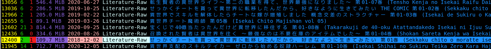

# koneko - TUI Client for nyaa.si 🐈🌐
 > Download Anime, Literature, Audio, Live Action, Pictures, Software

<p align="center"> Data -  <a href="https://github.com/irevenko/go-nyaa">go-nyaa</a> 
TUI - <a href="https://github.com/rivo/tview">tview</a>  </p> <br>


# Installation 🔨
```go get -u github.com/irevenko/koneko``` <br>

# About koneko ℹ️
- ✅ Supports ```UNIX``` and ```windows``` 
- 🚀 Could be faster than the  website because you can mark multiple torrents and download & open them all at once <br>


# Usage 🔬
```koneko <PROVIDER>``` - ```nyaa``` or ```sukebei``` <br> 

## Keybindings 🎹
| panel            | operation                | key                                                |
|------------------|--------------------------|----------------------------------------------------|
| search           | navigate                 | <kbd>Tab</kbd> / <kbd>Shift</kbd> + <kbd>Tab</kbd> |
| search           | focus results            | <kbd>Esc</kbd>                                     |
| results          | mark torrent             | <kbd>Enter</kbd>                                   |
| results          | download marked torrents | <kbd>Ctrl</kbd> + <kbd>D</kbd>                     |
| results          | open marked torrents     | <kbd>Ctrl</kbd> + <kbd>O</kbd>                     |
| results          | get marked torrent info  | <kbd>Ctrl</kbd> + <kbd>I</kbd>                     |
| results          | move down                | <kbd>j</kbd> / <kbd>↓</kbd>                        |
| results          | move up                  | <kbd>k</kbd> / <kbd>↑</kbd>                        |
| results          | move to the top          | <kbd>g</kbd> / <kbd>home</kbd>                     |
| results          | move to the bottom       | <kbd>G</kbd> / <kbd>end</kbd>                      |
| results          | focus search             | <kbd>Esc</kbd> / <kbd>Tab</kbd>                    |
| all              | open help                | <kbd>Ctrl</kbd> + <kbd>H</kbd>                     |
| all              | exit                     | <kbd>Ctrl</kbd> + <kbd>C</kbd>                     |

# Contributing 🤝
Contributions, issues and feature requests are welcome! 👍 <br>
Feel free to check [open issues](https://github.com/irevenko/koneko/issues).

## Show your support 🌟
Give a ⭐️ if this project helped you!

# Quick Start 🚀
```git clone https://github.com/irevenko/koneko.git``` <br>
```cd koneko``` <br>
```go get -d ./...``` <br>
```go build``` <br>

# What I Learned 🧠
- Building TUI's using tview and tcell

# ToDo
- [ ] Pretty color theme
- [ ] Add bookmars, history

# License 📑 
(c) 2021 Ilya Revenko. [MIT License](https://tldrlegal.com/license/mit-license)
